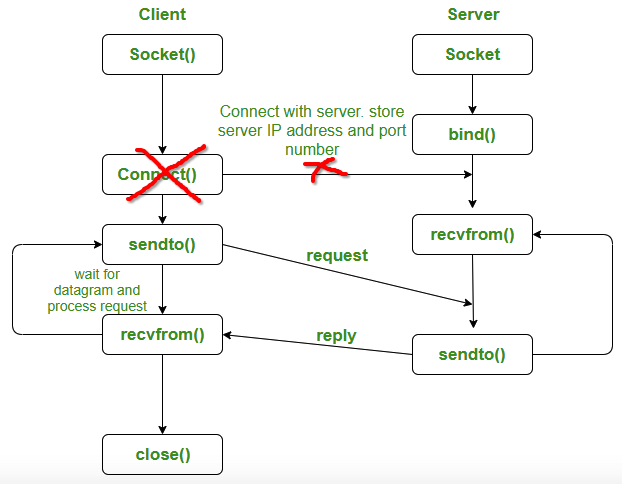
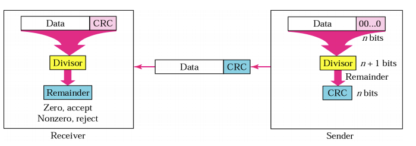

### CISC 4615 Lab 2 base code

In the Lab 1, we learned how to programming with sockets and TCP. In the lab 2, we will
UPD as our protocol and integrate CRC into the tranmissions.Different from TCP, UDP is a connection less protocol. There is no connection is established between client and server. 
 

---
#### UDP Protocol Workflow

In UDP, the client does not form a connection with the server like in TCP and instead, it just
sends a datagram. Similarly, the server need not to accept a connection and just waits for
datagrams to arrive. We can call a function called connect() in UDP but it does not result
anything like it does in TCP. There is no 3 way handshake(we will study this topic later). It
just checks for any immediate errors and store the peer’s IP address and port number. connect()
is storing peers address so no need to pass server address and server address length arguments
in sendto().

---
#### CRC Generator and Checker

Cyclic Redundancy Check (CRC) is an error detection mechanism in which a special number
is appended to a block of data in order to detect any changes introduced during storage (or
transmission).
Transmitted messages are divided into predetermined lengths that are divided by a fixed divisor. According to the calculation, the remainder number is appended onto and sent with the
message. When the message is received, the receiver recalculates the remainder and compares it to the
transmitted remainder. If the numbers do not match, an error is detected.

 
 
 ---
#### Study the sample code

Please study the sample code to understand the code style and logic of the samples. The samples are written in both CPP and Python2.7.

- Sample 1: Client sends a message to server by using UDP protocol. Client will break out of the loop by typing `bye`.
- Sample 2: User inputs a message, the program will calculate the CRC32 code for this message.
- Sample 3: client accepts a message from the users, and calculates a CRC32 code for this messgae. Then, it sends the message along with the CRC32 code to the server.

After compiling the samples (c++), you can run the samples as shown below (using python2.7)

- Sample 1:
	- CPP: ./server 9000(port number) and ./client 127.0.0.1 9000(port number)
	- Python: python2.7 client.py 127.0.0.1 9000 and python server.py 9000

- Sample 2: 
	- CPP: ./crc
	- Python: python2.7 crc.py
- Sample 3:
	- CPP: ./server 9000(port number) and ./client 127.0.0.1 9000(port number)
	- Python: python2.7 client.py 127.0.0.1 9000 and python server.py 9000
 
 

 

---